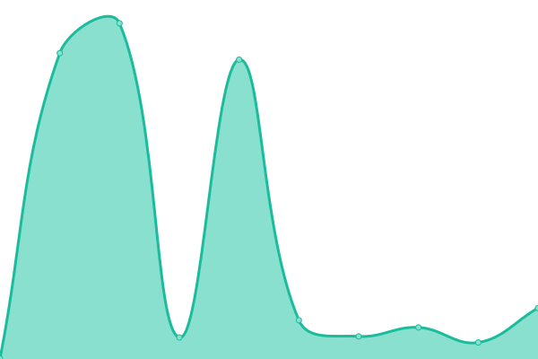
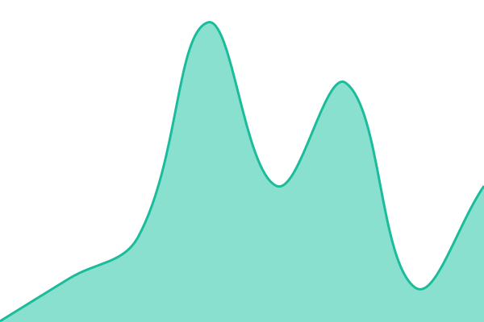
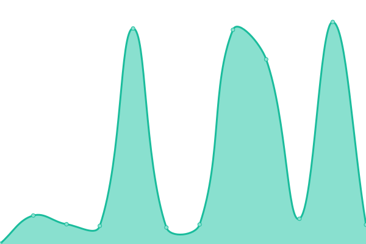

This repository contains the open-source uptime monitor and status page for [lakejason0](https://lakejason0.wordpress.com), powered by [Upptime](https://github.com/upptime/upptime).

With [Upptime](https://upptime.js.org), you can get your own unlimited and free uptime monitor and status page, powered entirely by a GitHub repository. We use [Issues](https://github.com/lakejason0/status/issues) as incident reports, [Actions](https://github.com/lakejason0/status/actions) as uptime monitors, and [Pages](https://status.lakejason0.ml) for the status page.

<!--start: status pages-->
<!-- This summary is generated by Upptime (https://github.com/upptime/upptime) -->
<!-- Do not edit this manually, your changes will be overwritten -->
<!-- prettier-ignore -->
| URL | 状态 | 历史 | 延迟时间 | 在线时间 |
| --- | ------ | ------- | ------------- | ------ |
|  [存档计划（MediaWiki）](https://lakeus.xyz) | 🟩 正常 | [media-wiki.yml](https://github.com/lakejason0/status/commits/HEAD/history/media-wiki.yml) | 

 397ms
     
 | 

<a href="https://status.lakeus.xyz/history/media-wiki">94.56%</a>
    

|  [Lake桑的存档馆（WordPress.com）](https://lakejason0.wordpress.com) | 🟩 正常 | [lake-word-press-com.yml](https://github.com/lakejason0/status/commits/HEAD/history/lake-word-press-com.yml) | 

 171ms
     
 | 

<a href="https://status.lakeus.xyz/history/lake-word-press-com">100.00%</a>
    

|  [静态主页（Static）](https://static.lakeus.xyz) | 🟩 正常 | [static.yml](https://github.com/lakejason0/status/commits/HEAD/history/static.yml) | 

 412ms
     
 | 

<a href="https://status.lakeus.xyz/history/static">96.38%</a>
    

|  [Lake桑的存档馆（GitHub.io）](https://lakejason0.github.io) | 🟩 正常 | [lake-git-hub-io.yml](https://github.com/lakejason0/status/commits/HEAD/history/lake-git-hub-io.yml) | 

 116ms
     
 | 

<a href="https://status.lakeus.xyz/history/lake-git-hub-io">100.00%</a>
    

<!--end: status pages-->

[**查看站点状态 →**](https://status.lakeus.xyz)

## 📄 许可协议

- Powered by: [Upptime](https://github.com/upptime/upptime)
- Code: [MIT](./LICENSE) © [lakejason0](https://lakejason0.wordpress.com)
- Data in the `./history` directory: [Open Database License](https://opendatacommons.org/licenses/odbl/1-0/)
- Translation by [Dianliang233](https://github.com/Dianliang233) and [lakejason0](https://github.com/lakejason0)
